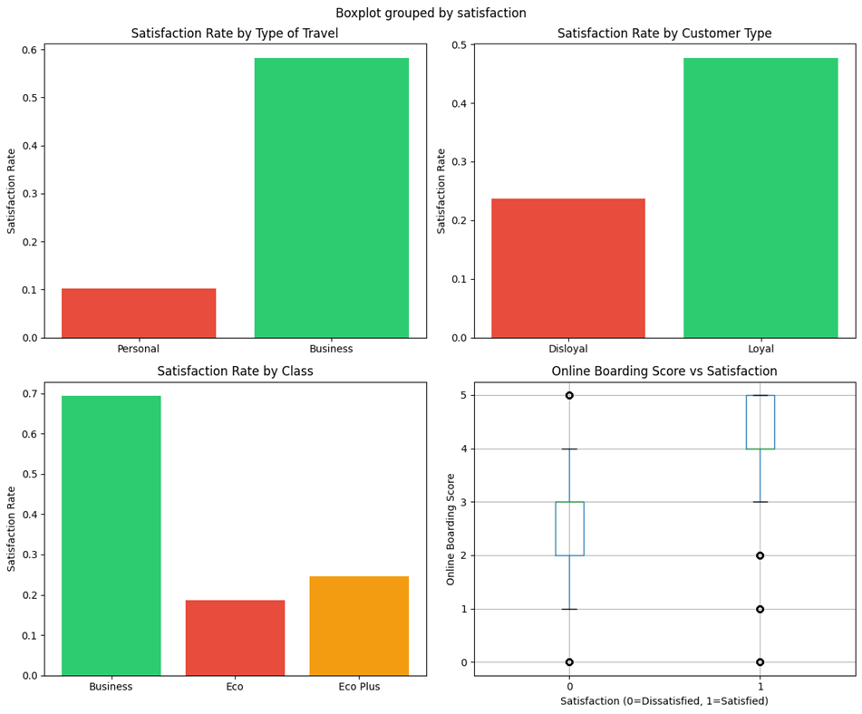

# Airline Passenger Satisfaction Prediction ✈️

A Machine Learning classification project to predict airline passenger satisfaction based on passenger demographics, flight information, travel details, and service experience.

The objective of this project is to develop machine learning models that classify passengers into:

* **Satisfied**
* **Neutral or Dissatisfied**

and identify the key factors that influence airline customer satisfaction.

---

# 📌 Project Overview

Customer satisfaction is one of the most important factors in the airline industry. By analyzing passenger data and applying machine learning techniques, airlines can better understand customer behavior and improve service quality.

This project covers the complete machine learning workflow:

* Exploratory Data Analysis (EDA)
* Data Cleaning
* Feature Engineering
* Data Preprocessing
* Feature Scaling
* Machine Learning Model Training
* Model Evaluation
* Feature Importance Analysis
* Business Insight Visualization

---

# 📂 Dataset

The dataset used in this project is the **Airline Passenger Satisfaction Dataset** from Kaggle.

Dataset Link:

https://www.kaggle.com/datasets/teejmahal20/airline-passenger-satisfaction

The dataset contains information about:

* Passenger demographics
* Customer type
* Type of travel
* Travel class
* Flight distance
* Service ratings
* Departure and arrival delays
* Passenger satisfaction

---

# 🎯 Target Variable

The prediction target is:

```text
satisfaction
```

Encoding:

| Original Value          | Encoded Value |
| ----------------------- | ------------- |
| satisfied               | 1             |
| neutral or dissatisfied | 0             |

---

# 🔄 Project Workflow

## 1. Data Loading

The dataset was loaded using Pandas.

Initial analysis included:

* Dataset dimensions
* Feature names
* Data types
* Satisfaction distribution

---

# 🧹 Data Preprocessing

## Missing Values

Rows containing missing values were removed.

## Removing Unnecessary Columns

The following columns were removed:

* `Unnamed: 0`
* `id`

because they do not provide useful predictive information.

---

# 🔢 Feature Engineering

Categorical features were converted into numerical values.

### Gender

```
Male → 1
Female → 0
```

### Customer Type

```
Loyal Customer → 1
Disloyal Customer → 0
```

### Type of Travel

```
Business Travel → 1
Personal Travel → 0
```

### Satisfaction

```
Satisfied → 1
Neutral/Dissatisfied → 0
```

One-hot encoding was applied to:

* Class

---

# 📊 Feature Scaling

Numerical features were standardized using:

`StandardScaler`

Scaled features:

* Age
* Flight Distance
* Departure Delay in Minutes
* Arrival Delay in Minutes

---

# 🤖 Machine Learning Models

Three classification algorithms were trained and compared:

## Logistic Regression

A baseline linear classification model.

---

## Random Forest Classifier

An ensemble learning algorithm based on multiple decision trees.

Parameters:

```python
n_estimators = 100
random_state = 42
```

---

## Gradient Boosting Classifier

A boosting algorithm that improves prediction performance by combining multiple weak learners.

Parameters:

```python
n_estimators = 100
random_state = 42
```

---

# 📈 Model Evaluation

Models were evaluated using:

* Accuracy Score
* Precision
* Recall
* F1-score
* Classification Report

The Random Forest model was selected for further analysis due to its strong performance.

---

# 🌲 Feature Importance Analysis

Feature importance was extracted from the Random Forest model to identify the most influential features affecting passenger satisfaction.

Features with importance values:

```
>= 0.01
```

were selected for a reduced-feature model.

The performance of:

* Full feature model
* Selected feature model

was compared.

---

# 📊 Results

## Confusion Matrix

The confusion matrix shows the performance of the final Random Forest classifier.


---

# 💡 Passenger Satisfaction Insights

Business analysis was performed to understand how different factors affect passenger satisfaction.

The following insights were analyzed:

* Satisfaction rate by travel type
* Satisfaction rate by customer type
* Satisfaction rate by travel class
* Relationship between online boarding score and satisfaction



---

# 📁 Project Structure

```text
airline-passenger-satisfaction-prediction/

│
├── README.md
├── requirements.txt
│
├── notebooks/
│   └── airline-passenger-satisfaction.ipynb
│
└── images/
    ├── confusion_matrix.png
    └── satisfaction.png
```

---

# 🛠️ Technologies Used

* Python
* Pandas
* NumPy
* Scikit-learn
* Matplotlib
* Jupyter Notebook

---

# ▶️ How to Run

Clone the repository:

```bash
git clone https://github.com/your-username/airline-passenger-satisfaction-prediction.git
```

Install dependencies:

```bash
pip install -r requirements.txt
```

Download the dataset from Kaggle and run the notebook:

```text
notebooks/airline-passenger-satisfaction.ipynb
```

Run all cells to reproduce the results.

---

# 🚀 Future Improvements

Possible improvements:

* Hyperparameter tuning using GridSearchCV
* Cross-validation
* Saving trained models
* Building a prediction API
* Deploying the model using Streamlit

---

# 👤 Author

Your Name

Machine Learning | Data Science Project
