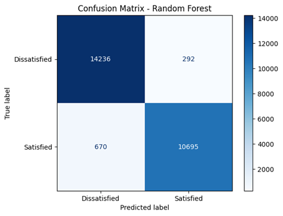

# Airline Passenger Satisfaction Prediction ✈️

A Machine Learning project that predicts airline passenger satisfaction using passenger demographic information, travel details, flight experience, and service-related features.

The goal of this project is to build classification models that can identify whether an airline passenger is **Satisfied** or **Neutral/Dissatisfied** and analyze the key factors affecting customer satisfaction.

---

# 📌 Project Overview

Customer satisfaction is one of the most important factors in the airline industry. By using machine learning techniques, airlines can understand passenger experiences and identify the features that have the greatest impact on satisfaction.

This project includes:

* Data exploration
* Data cleaning
* Feature engineering
* Feature encoding
* Feature scaling
* Machine learning model training
* Model evaluation
* Feature importance analysis
* Business insight visualization

---

# 📂 Dataset

The dataset contains airline passenger survey information, including:

* Passenger demographics
* Flight distance
* Travel type
* Customer loyalty status
* Travel class
* Service ratings
* Delay information
* Passenger satisfaction

## Target Variable

The target variable is:

```text
satisfaction
```

Encoding:

| Satisfaction Status     | Value |
| ----------------------- | ----- |
| satisfied               | 1     |
| neutral or dissatisfied | 0     |

---

# 🔄 Project Workflow

## 1. Data Loading

The training and testing datasets were loaded using Pandas.

Initial analysis was performed:

* Dataset shape
* Column names
* Data types
* Target distribution

---

# 🧹 Data Preprocessing

## Missing Values

Rows containing missing values were removed.

## Removing Unnecessary Columns

The following columns were removed:

* `Unnamed: 0`
* `id`

because they do not provide useful information for prediction.

---

# 🔢 Feature Engineering

Categorical variables were converted into numerical values.

### Gender

```
Male → 1
Female → 0
```

### Customer Type

```
Loyal Customer → 1
Disloyal Customer → 0
```

### Type of Travel

```
Business Travel → 1
Personal Travel → 0
```

### Satisfaction

```
Satisfied → 1
Neutral/Dissatisfied → 0
```

One-hot encoding was applied to:

* Class

---

# 📊 Feature Scaling

Numerical features were standardized using:

`StandardScaler`

Scaled features:

* Age
* Flight Distance
* Departure Delay in Minutes
* Arrival Delay in Minutes

---

# 🤖 Machine Learning Models

Three classification algorithms were trained:

## 1. Logistic Regression

A baseline linear classification model.

## 2. Random Forest Classifier

An ensemble learning algorithm using multiple decision trees.

Parameters:

```python
n_estimators = 100
random_state = 42
```

## 3. Gradient Boosting Classifier

A boosting algorithm that improves prediction performance by combining multiple weak learners.

Parameters:

```python
n_estimators = 100
random_state = 42
```

---

# 📈 Model Evaluation

The models were evaluated using:

* Accuracy Score
* Precision
* Recall
* F1-score
* Classification Report

The Random Forest model was selected for further analysis because of its strong performance.

---

# 🌲 Feature Importance Analysis

Feature importance was extracted from the Random Forest model to identify the most influential factors affecting passenger satisfaction.

Features with importance greater than:

```
0.01
```

were selected and used to train a reduced-feature model.

The performance between:

* All Features Model
* Selected Features Model

was compared.

---

# 📊 Model Output

## Confusion Matrix

The confusion matrix shows how well the final Random Forest model classified satisfied and dissatisfied passengers.



---

# 💡 Business Insights

Additional analysis was performed to understand passenger satisfaction patterns.

The following relationships were analyzed:

* Satisfaction rate by travel type
* Satisfaction rate by customer type
* Satisfaction rate by travel class
* Relationship between online boarding score and satisfaction


---

# 📁 Project Structure

```text
airline-passenger-satisfaction-prediction/

│
├── README.md
│
├── notebooks/
│   └── airline-passenger-satisfaction.ipynb
│
├── images/
│   ├── confusion_matrix.png
│   └── business_insights.png
│
├── data/
│   └── raw/
│       ├── train.csv
│       └── test.csv
│
└── requirements.txt
```

---

# 🛠️ Technologies Used

* Python
* Pandas
* NumPy
* Scikit-learn
* Matplotlib
* Jupyter Notebook

---

# ▶️ How to Run the Project

Clone the repository:

```bash
git clone https://github.com/your-username/airline-passenger-satisfaction-prediction.git
```

Install required libraries:

```bash
pip install -r requirements.txt
```

Open the notebook:

```text
notebooks/airline-passenger-satisfaction.ipynb
```

Run all cells to reproduce the results.

---

# 🚀 Future Improvements

Possible improvements:

* Hyperparameter tuning using GridSearchCV
* Cross-validation
* Model saving using Pickle
* Building a prediction API
* Deploying the model with Streamlit

---

# 👤 Author

Your Name

Machine Learning | Data Science Project
